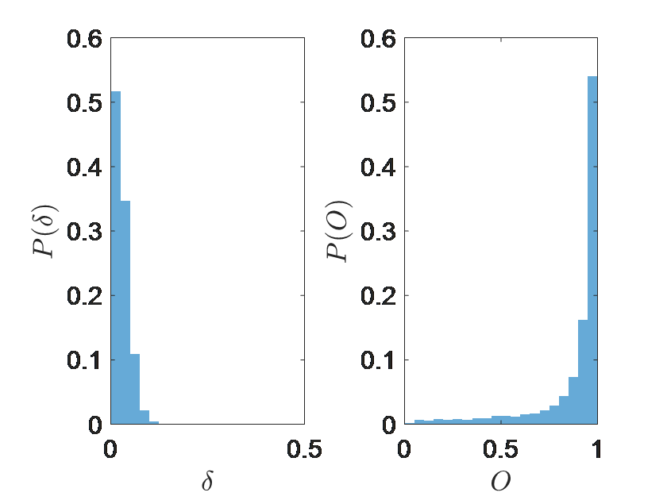

# General description
The set of MATLAB codes implements the Physics-Informed Machine Learning formalism, outlined in [1]. In particular, the code illustrates Physics-Informed Machine Learning on example of calculating the spatial profile and the propagation constant of the fundamental mode supported by the periodic layered composites whose optical response can be predicted via Rigorous-Coupled Wave Analysis (RCWA). The codes implements both the structure of the predicted solution and RCWA into loss functions of Artificial Neural Nets. See [1] for full description of the formalism; please refer to MATLAB documentation for description of Matlab language and of Deep Learning toolbox.
The code requires MATLAB Deep Learning Toolbox to run. The code was tested on MATLAB R2020b and MATLAB R2021a on computers that have NVIDIA GeForce graphics cards of Pascal and Turing generations. 

# List of files
<li>annRun.m – script used to train the neural network
<li>annTest.m – script used to test the neural network
<li>generateRCWAdata.m – script used to generate the datasets
<li>mergeNormLayer.m – custom layer that normalizes the eigenvectors (predicted by the neural net) to unit magnitude and appends the configurations (passed on by the split layer) to the neural net predictions. The latter data is used for Physics-Informed Regression Layer. Merge Norm Layer should be positioned right before regression layer. 
<li>MGregressionLayer.m – Meaning-Informed Regression layer; implements meaning-informed loss function
<li>nmFold.m – a function that converts the line vector generated by the neural network into complex eigenvalue and a set of complex-valued Fourier components hm. 
<li>PGregressionLayer.m – Physics-informed Regression Layer; implements physics-informed loss function; since double-precision matrix multiplication is used, backward loss needs to be explicitly defined. 
<li>rcwaFun.m – implementation of the RCWA algorithm. 
<li>runMe.m – script illustrating the typical dataset generation/neural net training/neural net testing workflow; creates “m=50” folder if needed. 
<li>splitLayer.m – custom layer, positioned at the beginning of the network, used to “store” the configuration array and pass it to the merge layer. 

# Workflow
In general, workflow consists of three distinct processes: 
<ol>
  <li>Dataset generation via RCWA (the process involves creation of the multilayered composites, along with the exact solutions of the structure of the fundamental mode, used for training and testing purposes). This task is accomplished by running generateRCWAdata.m file
<li>	Neural Net Training, accomplished by running annRun.m file
<li>	Neural Net Testing, accomplished by running annTest.m file. 
</ol>
  Full cycle of data generation/ neural net training/ testing can be accomplished by running file “runMe.m”. 
By default, the code generates low-index photonic dataset from [1], trains meaning-informed model on 10% of this dataset, and uses the model to predict all modes of the dataset. The resulting figure is shown below. Note that individual runs may produce somewhat different distributions of accuracy, especially when training set is small and limited to specific angles/etc. 
Individual files can be used to run specific tasks; files can be edited to adjust data generation, selection of data for training subset, etc. Basic functionality is described below
  

# Dataset Generation (generateRCWAdata.m)
Algorithm represents an implementation of the RCWA formalism, as described in Ref.[1]. The code generates a dataset for the structure of the fundamental modes supported by a periodically stratified layered composites. The parameters, outlined in the beginning of the file provide the control over the vacuum wavelength of optical signals, period of the composite, values of the parameter theta used to determine the quasi-wavenumber of the modes, as well as number of layers in the composite and the maximum refractive index in the stack, as well as the probability of encountering plasmonic layer within the stack. Finally, the complexity of the composite is parameterized by specifying the number of Fourier components via parameter mMax. 
The code generates a number of unique distributions of the refractive indices, and – for each distribution of refractive indices – generates the fundamental modes for specified values of parameter theta. 
The resulting dataset is saved in matlab “.mat” file. Default filename is “./m=50/dataFull.mat”. 

# Neural Network Training (annRun.m)
This file creates and trains neural network. The resulting trained neural network (along with training, validation, and testing subsets used in the training process) is stored in the datafile (default name “/m=50/ANNtest.mat” name is used.  
Use the parameter NNtype to control the Regression layer that is used. 
  <ul>
<li>NNtype=1 employs the default Regression Layer provided with Deep Learning Toolbox;
<li>NNtype=2 inserts the Meaning-Informed regression layer
<li>NNtype=3 or NNtype=4 inserts Physics-Informed Regression layer; The latter choice also adds configurations from validation subset as unlabeled training data. 
  </ul>
  The parameter angleLim is used to choose to limit the training set to particular values of parameter theta (default run does not restrict dataset). 
The script first loads the dataset, then builds the neural net, splits the original dataset into training/validation/testing subsets (default split is 10%/10%/80%; anonymized validations configurations are added to training set when NNtype==4), followed by training (GPU training is assumed), and saving the model. 

# Neural Network Testing (annTest.m)
The data analysis file loads the trained model and, separately, the dataset file. It then uses the configuration set of the datafile and the model to predict the properties of the fundamental modes of all configurations within the datafile. Finally, the script calculates the accuracy parameters delta and O by comparing the predicted properties of the modes to the ground truth from the original dataset and plots the probability distributions of parameters delta and O. 
By modifying the names of the input files, it is possible to evaluate predictions of the models on the datasets that it has not been trained on. Also, it is possible to modify the code to analyze the performance of the model on training/validation/testing subsets of the original dataset (these subsets are stored within the same file as the trained network) 

# Reference
[1] A. Ghosh, M. Elhamod, J. Bu, W.C. Lee, A. Karpatne, V.A. Podolskiy, Physics-Informed Machine Learning for Optical Modes in Composites; arXiv:2112.07625 (2021)
